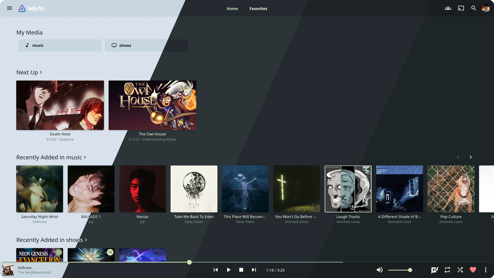
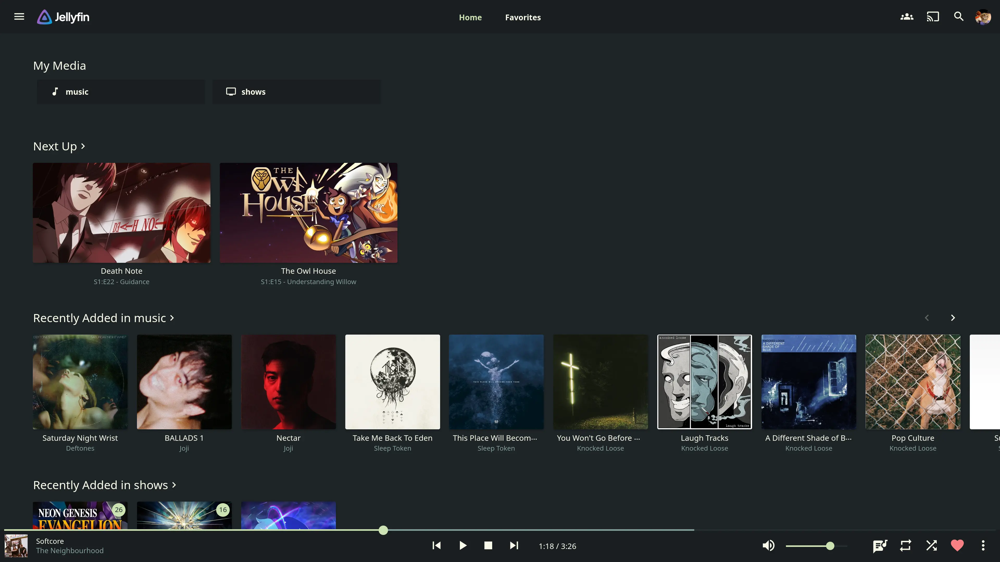
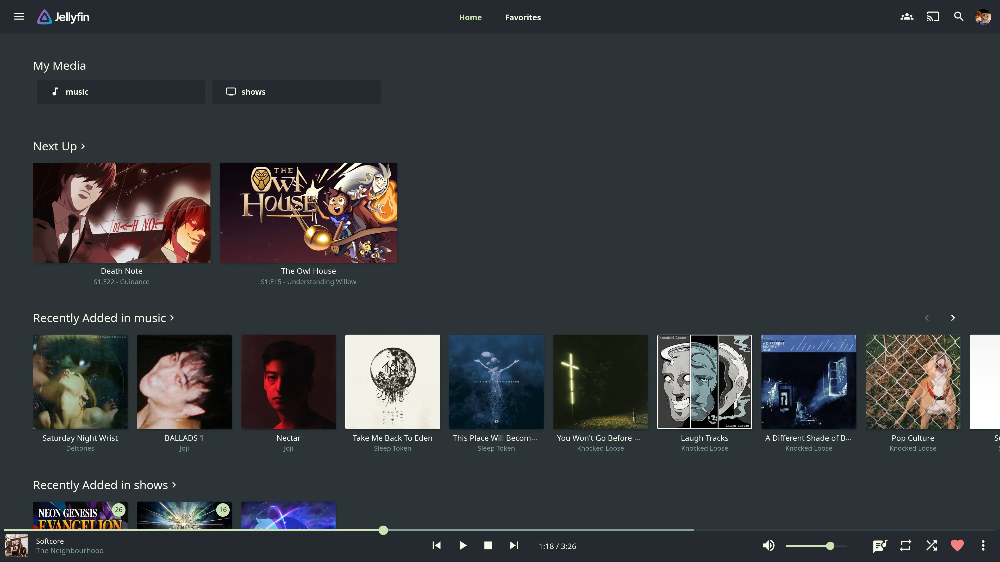

<h3 align="center">
  <br/>
  Evergarden for <a href="https://jellyfin.org">Jellyfin</a>
</h3>

<p align="center">
  <a href="https://codeberg.org/evergarden/jellyfin/stars">
    
  </a>
  <a href="https://codeberg.org/evergarden/jellyfin/issues">
    
  </a>
  <a href="https://codeberg.org/evergarden/jellyfin/activity/contributors">
    
  </a>
</p>

<p align="center">
  
</p>

### Previews

<details>
  <summary>Winter</summary>
  
</details>
<details>
  <summary>Fall</summary>
  
</details>
<details>
  <summary>Spring</summary>
  
</details>
<details>
  <summary>Summer</summary>
  
</details>

### Usage

1. Copy your preferred palette's import rule:
  ```css
  /* Winter */
  @import url("https://everviolet.github.io/jellyfin/evergarden-winter.css");
  /* Fall */
  @import url("https://everviolet.github.io/jellyfin/evergarden-fall.css");
  /* Spring */
  @import url("https://everviolet.github.io/jellyfin/evergarden-spring.css");
  /* Summer */
  @import url("https://everviolet.github.io/jellyfin/evergarden-summer.css");
  ```
2. Open settings, navigate to Display and paste the CSS into the section called "Custom CSS code"
3. Press Save and enjoy the pretty colors!

### Customization

The accent color can be overridden by adding the following **after** the import:
```css
:root {
  --main-color: var(--pink);
}
```

### Thanks to <3

- [koi](https://codeberg.org/koibtw)
- [Catppuccin for Jellyfin](https://github.com/catppuccin/jellyfin?tab=readme-ov-file#-thanks-to)

<hr>

<p align="center">
  <a href="https://codeberg.org/evergarden/jellyfin/src/COPYING">
    
  </a>
</p>
